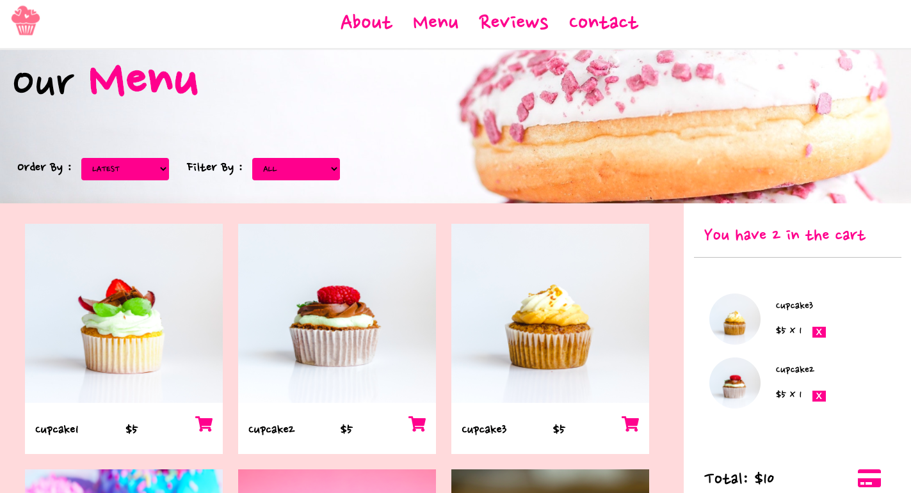

[Sweetie-Backend-Here](https://github.com/Tanattha/sweetie-backend)

# Sweetie-Frontend

This part was built with React / Redux. Contained with container and stateless components to determined an app's behaviour. Utilized Redux middleware to respond and modify state change and Redux Thunk middleware to send and receive data from a Rails server. 

## Live App

[CLICK HERE]

## Video Walkthrough

[CLICK HERE]

## Installation

Fork and clone repos

    $ git clone https://github.com/Tanattha/sweetie-frontend

Using two terminals, switch to each respective directory

    $ cd sweetie-frontend

Install the packages

    $ npm install

Startup the server for frontend

    $ npm start

If you already run a Rails server, you may be prompted to use an alternate port - type Y or YES for continue.

## License

The gem is available as open source under the terms of the [MIT License](https://opensource.org/licenses/MIT).

## Special Thanks

https://www.pexels.com/ 
https://favicon.io/ 
[Font: Nanum Pen Script Designed by Sandoll](https://fonts.google.com/specimen/Nanum+Pen+Script)

and everything else from google!

